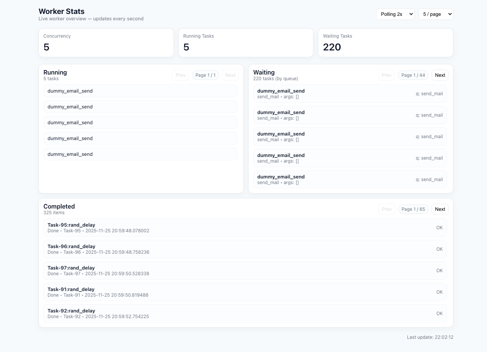

# Coroutine Runner

`coro_runner` is a Python library designed to simplify the execution and management of asynchronous tasks using `asyncio`. This library provides a convenient interface to run, manage, and monitor coroutines efficiently.

## Installation

To install `coro-runner`, use pip:

```bash
pip install coro-runner
```

## Usage

### Basic Example

Here is a basic example of how to use `coro_runner` to run a simple coroutine:

```python
import asyncio
from coro_runner import CoroRunner

async def my_coroutine():
    await asyncio.sleep(1)
    print("Hello, World!")

runner = CoroRunner(concurrency=10)
for _ in range(count):
        runner.add_task(rand_delay, args=(), kwargs={})
```

### Defining the queue with priority

```python
runner = CoroRunner(
    concurrency=25,
    queue=QueueConfig(
        queues=[
            Queue(name="send_mail", score=2),
            Queue(name="async_task", score=10),
            Queue(name="low_priority", score=0.1),
        ],
    ),
)
# Add the tasks to the queue
runner.add_task(rand_delay, queue_name="low_priority")
# Another queue
runner.add_task(rand_delay, queue_name="async_task")
```

**Note: The higher value of score menas it has high priority.**

### Using with RedisBackend

Currently we have two backend options. They are, InMemoryBackend and RedisBackend. By default InMemoryBackend is activated. For Redis backend see the following example,

```python
runner = CoroRunner(
    concurrency=5,
    backend=RedisBackend(conf=RedisConfig(host="192.168.10.100", port=6379, db=0)),
)
```

**If you have auth in redis? then, you can send password on RedisConfig**

## Logging

By default, the `coro_runner` logger is disabled. You can easily enable logging by passing the `log_level` argument to the `CoroRunner`.

```python
import logging
from coro_runner import CoroRunner

runner = CoroRunner(
    concurrency=10,
    log_level=logging.INFO
)
```

This will output the logs to the standard output (console).

## Stats/Reporting Page



**You'll get your desired data at here,**

```python
runner.get_report()
```

**Sample**

```json
{
  "concurrency": 1,
  "running_task_count": 1,
  "waiting_task_count": 1,
  "waiting_tasks": [
    {
      "name": "rand_delay",
      "module": "example.tasks",
      "queue": "low_priority",
      "received": "2025-12-03 15:27:48.798037",
      "status": 0,
      "task_id": "73556910-5bde-4d78-8559-03261e9ecc5a",
      "args": [
        "Static Msg",
        10
      ],
      "kwargs": {},
      "result": null,
      "started": null,
      "finished": null,
      "exception": null,
      "remark": null
    }
  ],
  "running_tasks": [
    {
      "name": "rand_delay",
      "module": "example.tasks",
      "queue": "low_priority",
      "received": "2025-12-03 15:27:48.800716",
      "status": 1,
      "task_id": "96e551e8-d11f-4d44-adeb-89743312553b",
      "args": [
        "Static Msg",
        10
      ],
      "kwargs": {},
      "result": null,
      "started": "2025-12-03 15:33:33.768377",
      "finished": null,
      "exception": null,
      "remark": null
    }
  ],
  "completed_tasks": [
    {
      "name": "rand_delay",
      "module": "example.tasks",
      "queue": "low_priority",
      "received": "2025-12-03 15:27:48.815023",
      "status": 2,
      "task_id": "bcfc2a30-5c94-4e87-8ef4-69ad2b1cfda7",
      "args": [
        "Static Msg",
        10
      ],
      "kwargs": {},
      "result": "Done - Task-3",
      "started": "2025-12-03 15:30:23.438796",
      "finished": "2025-12-03 15:30:24.673085",
      "exception": null,
      "remark": null
    }
  ],
  "failed_tasks": [],
  "cancelled_tasks": [
    {
      "name": "rand_delay",
      "module": "example.tasks",
      "queue": "low_priority",
      "received": "2025-12-03 15:27:48.788677",
      "status": 4,
      "task_id": "b7469ba4-de5c-4117-b8ef-2655cef30f52",
      "args": [
        "Static Msg",
        10
      ],
      "kwargs": {},
      "result": null,
      "started": "2025-12-03 15:27:48.820860",
      "finished": "2025-12-03 15:28:00.158958",
      "exception": null,
      "remark": "Server Restarted"
    }
  ]
}
```

## Revive and Restore the waiting tasks

Here you can easily start your waiting tasks after server got restarted. But remember you must need a physical db backend(Currently RedisBackend.).

**Just call the following method at your application startup.**

```python
await runner.revive_and_restore_waiting_tasks()
```
